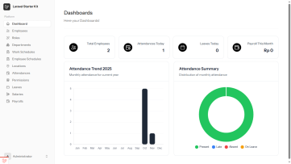

# HRIS-Laravel

A **simple web-based Human Resource Information System (HRIS)** built with **Laravel**, **Livewire**, **Tailwind CSS**, and **MySQL**.  
This project aims to provide basic HR management features in an easy-to-use and extendable system.

---

##  Features

-  Employee Management  
-  Department & Role Management  
-  Work Schedule and Employee Schedule Management  
-  Location-based Attendance (employees can only check in within a defined radius)  
-  Leave & Permission Requests  
-  Payroll Management  
-  Authentication and Role-based Access (Admin & Employee)

---

## Tech Stack

| Technology | Description |
|-------------|-------------|
| **Laravel** | PHP web framework for backend development |
| **Livewire** | Reactive components for Laravel without writing JavaScript |
| **Tailwind CSS** | Utility-first CSS framework for modern UI design |
| **MySQL** | Relational database for data storage |
| **PHP** | Server-side programming language |

---

## Screenshots

### Admin Dashboard


### Employee Dashboard


> Replace `path/to/...` with the actual paths to your images (e.g. `public/images/admin.png`).

---

## Installation

1. **Clone the repository**
   ```bash
   git clone https://github.com/MuhIqbal08/hris-laravel.git
   cd hris-laravel

2. **Install dependencies**
    composer install
    npm install && npm run dev


3. **Set up environment**
    cp .env.example .env
    php artisan key:generate


4. **Configure your database**
    Update the .env file with your database credentials.

5. **Run migrations and seeders**
    php artisan migrate --seed


6. **Run the application**
    php artisan serve


Then open your browser and visit:
    http://localhost:8000

## Notes
This is a simple HRIS project with basic functionality and still has some limitations.
It is developed as a learning project and a foundation for building a more complete HRIS system in the future.